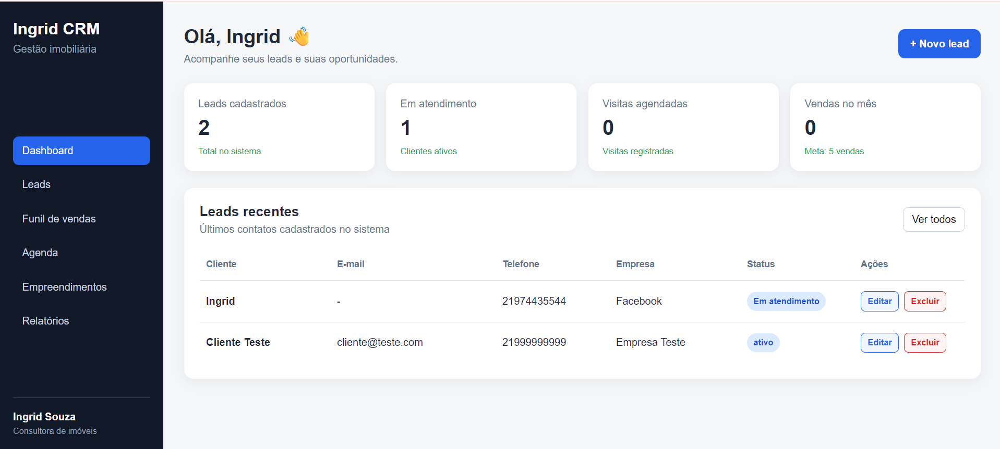

# 💼 Ingrid CRM

Sistema Full Stack de gerenciamento de clientes e leads, desenvolvido como projeto de portfólio para aplicar conceitos de desenvolvimento web, criação de APIs e integração com banco de dados.

O Ingrid CRM permite cadastrar, visualizar, editar e excluir clientes, além de acompanhar o status dos leads através de um dashboard simples e intuitivo.

---

## 🖥️ Preview do sistema



---

## 🚀 Funcionalidades

- 👥 Cadastro de clientes e leads
- 📋 Listagem de clientes cadastrados
- ✏️ Edição de informações
- 🗑️ Exclusão de clientes
- 📌 Gerenciamento de status dos leads
- 📊 Dashboard com indicadores
- 📈 Acompanhamento de leads em atendimento
- 🏠 Interface voltada para gestão imobiliária
- 📱 Layout responsivo
- 🔗 Integração entre Front-end, API e banco de dados

---

## 🛠️ Tecnologias utilizadas

### Front-end

- React
- JavaScript
- Vite
- HTML5
- CSS3

### Back-end

- Node.js
- Express
- API REST

### Banco de Dados

- PostgreSQL

### Ferramentas

- Git
- GitHub
- Visual Studio Code
- npm

---

## 🔄 Operações CRUD

O sistema possui as principais operações de gerenciamento de clientes:

- **Create** — Cadastro de novos clientes
- **Read** — Listagem dos clientes cadastrados
- **Update** — Edição dos dados de um cliente
- **Delete** — Exclusão de clientes

---

## 📊 Dashboard

O dashboard apresenta informações importantes para acompanhamento comercial, como:

- Total de leads cadastrados
- Leads em atendimento
- Visitas agendadas
- Vendas no mês
- Lista de leads recentes

---

## 🏗️ Estrutura do projeto

```text
IngridCRM/
│
├── backend/
│   ├── src/
│   │   ├── config/
│   │   ├── controllers/
│   │   ├── middleware/
│   │   ├── routes/
│   │   └── services/
│   ├── .env.example
│   ├── package.json
│   └── server.js
│
├── database/
│
├── docs/
│   └── images/
│       └── ingrid-crm-dashboard.png
│
├── frontend/
│   ├── src/
│   ├── public/
│   └── package.json
│
├── .gitignore
└── README.md
```

---

## ⚙️ Como executar o projeto

### 1. Clone o repositório

```bash
git clone <URL-DO-REPOSITORIO>
```

Entre na pasta do projeto:

```bash
cd IngridCRM
```

### 2. Configure o Back-end

Entre na pasta:

```bash
cd backend
```

Instale as dependências:

```bash
npm install
```

Crie um arquivo `.env` baseado no arquivo `.env.example` e configure os dados de acesso ao PostgreSQL.

Depois execute:

```bash
npm run dev
```

O servidor será iniciado, por padrão, na porta:

```text
http://localhost:3001
```

### 3. Execute o Front-end

Abra outro terminal e entre na pasta do front-end:

```bash
cd frontend
```

Instale as dependências:

```bash
npm install
```

Execute:

```bash
npm run dev
```

O Vite exibirá no terminal o endereço para acessar a aplicação no navegador.

---

## 🔐 Segurança

As credenciais do banco de dados não são armazenadas no repositório.

O arquivo `.env` é ignorado pelo Git e o projeto disponibiliza apenas um `.env.example` como modelo de configuração.

---

## 🎯 Objetivo do projeto

Este projeto foi desenvolvido com o objetivo de praticar e demonstrar conhecimentos em desenvolvimento Full Stack, incluindo:

- Desenvolvimento de interfaces com React
- Criação de APIs REST com Node.js e Express
- Integração com PostgreSQL
- Operações CRUD
- Consumo de API no Front-end
- Versionamento com Git e GitHub
- Organização de um projeto Full Stack

---

## 👩‍💻 Desenvolvedora

**Ingrid Souza**

Estudante de Tecnologia da Informação, desenvolvendo projetos para aprimorar conhecimentos em desenvolvimento de software, aplicações web e banco de dados.

---

## 📌 Status do projeto

🚧 **Em desenvolvimento**

O CRUD de clientes já está funcional. Novas funcionalidades poderão ser adicionadas futuramente, como autenticação de usuários, pesquisa, filtros, agenda, funil de vendas e gerenciamento de empreendimentos.